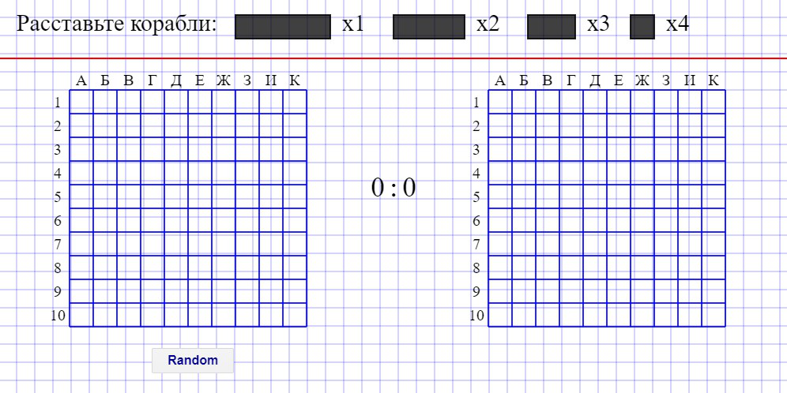
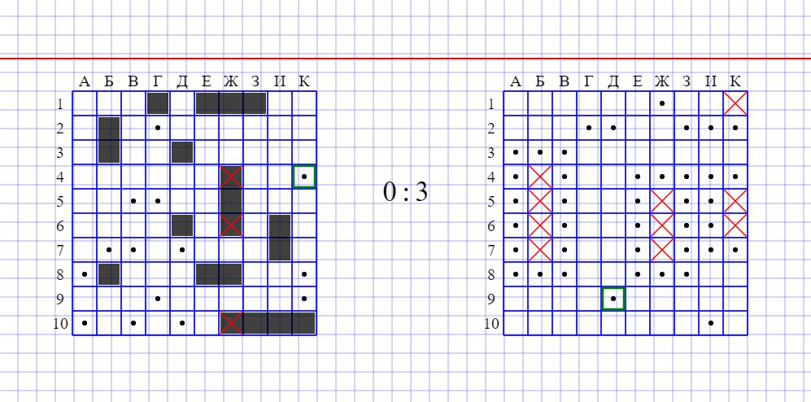
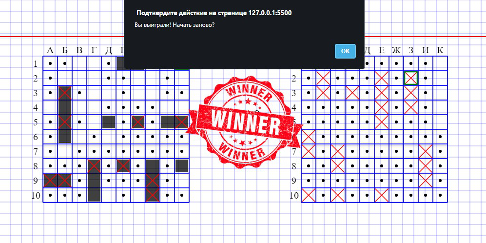

# game
sea battle game

# Strategy type guessing single player game called "Sea Battle"
Demo: https://wolfram18.github.io/JSProject-SeaBattle/
## Stage: Preparation
Place your ships manually or by pressing button "Random" (rotate ship via mouse wheel).

## Stage: Play
Try to hit bot's ships by clicking on their field. If you missed the turn goes to the opponent.

## Stage: Completion
After winning or losing you can start again.

